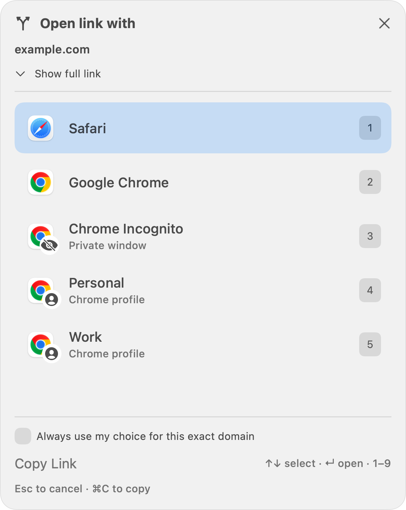
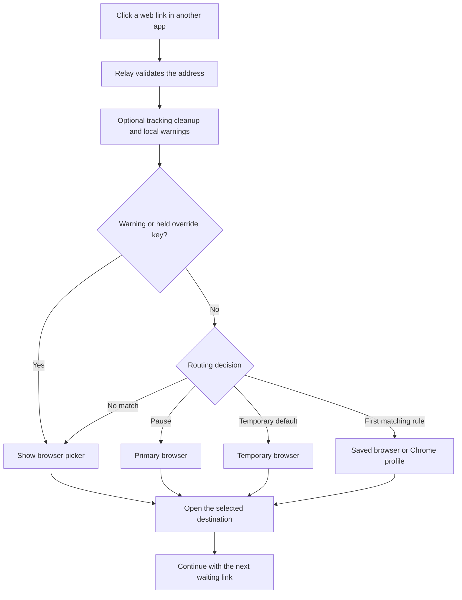
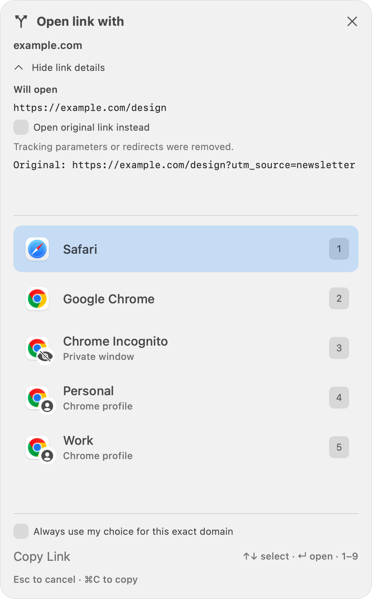
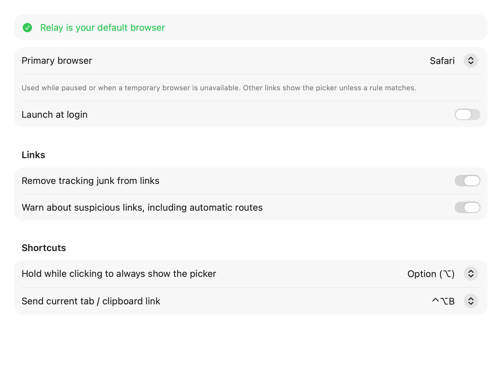
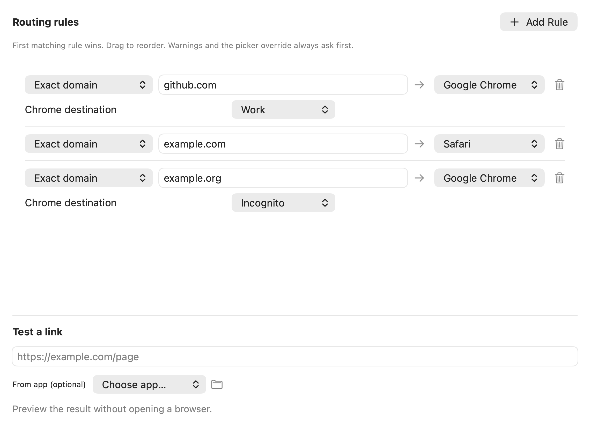
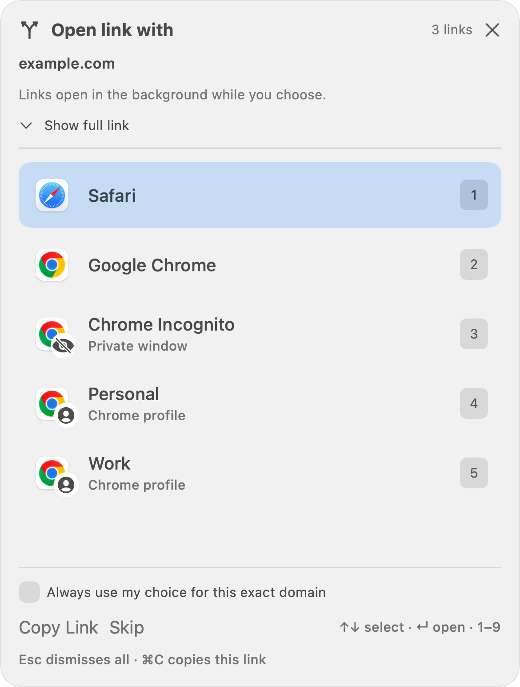

# Relay — browser picker for macOS

**Choose where every link opens.** Relay is a free, open-source Mac menu bar app that lets you send links to a browser, a Chrome profile, or an Incognito window. Keep work and personal browsing separate, automate familiar sites, and inspect cleaned links before opening them.

[](https://github.com/sumanth-botlagunta/relay/actions/workflows/ci.yml)
[](https://github.com/sumanth-botlagunta/relay/releases/latest)
[](LICENSE)


[**Download Relay for Mac →**](https://github.com/sumanth-botlagunta/relay/releases/latest) · [Installation help](docs/INSTALL.md) · [Report a bug](https://github.com/sumanth-botlagunta/relay/issues/new/choose) · [Contribute](CONTRIBUTING.md)

<p align="center">
  
</p>

## Why Relay?

You use more than one browser. A link from email, chat, or a document should open where you want it to. Set Relay as your default browser, then choose a destination when you click a web link. Save a rule for sites you open often.

- **Pick quickly.** Click a browser, press its number, or use the arrow keys and Return.
- **Separate browsing contexts.** Choose a named Chrome profile or Chrome Incognito. Other browsers appear as ordinary destinations.
- **Automate repeat choices.** Route exact domains, subdomains, or links from a source app. Test a rule without opening a page.
- **Clean tracking parameters.** Remove common tracking tags and supported redirect wrappers. Inspect the destination or keep the original URL.
- **Handle several links.** Links wait in order. Skip one or dismiss the whole group with Escape.
- **Override when you need to.** Hold Option while clicking to ask once, even when a rule applies. Set a temporary browser or pause routing from the menu.
- **Send an open tab.** Press Control–Option–B to choose another browser for the current tab. A clipboard fallback is clearly labeled.
- **Keep processing local.** No accounts, analytics, telemetry, or cloud service. Relay uses native SwiftUI and AppKit and has no third-party runtime dependencies.

## Install in a minute

**Requirements:** macOS 15 Sequoia or later, on Apple Silicon. Intel Macs and other operating systems are not supported.

1. Download the latest **`Relay-…-apple-silicon.dmg`** from [Releases](https://github.com/sumanth-botlagunta/relay/releases/latest).
2. Open the disk image and drag **Relay** into **Applications**.
3. Open Relay, then use **Settings → General → Make Default** and approve the macOS request. Relay lives in the menu bar; it has no Dock icon. Reopen it from Applications to reach Settings.
4. Click a link in another app, or try **Settings → Setup & Help → Test Picker**.

**Current testing builds are ad-hoc signed, but are not Apple Developer ID signed or notarized.** macOS may block the first launch. If you trust this release, follow [Apple’s instructions for opening an app from an unknown developer](https://support.apple.com/guide/mac-help/mh40616/mac) using **System Settings → Privacy & Security → Open Anyway**. Do not disable Gatekeeper. Managed Macs may prevent this override.

A ZIP download and SHA-256 checksums are also available. See [installation, updating, uninstalling, and troubleshooting](docs/INSTALL.md). There is no automatic updater yet.

## How links flow



Rules run in order; the first match wins. Suspicious-link warnings still ask before an automatic route when warnings are enabled. The picker shows queued links, keeps browsers in the background while choices remain, and brings the last selected browser forward when finished.

## See what will open

| Inspect a cleaned link | Set up your preferences |
| --- | --- |
|  |  |

[**View all seven interfaces in the full-resolution gallery →**](docs/GALLERY.md)

| Automate familiar sites | Handle several links |
| --- | --- |
|  |  |

These high-resolution images render Relay’s actual interface at 3× resolution with illustrative domains and profile names. Available browsers and settings depend on your Mac. No personal browsing data is shown.

## Keyboard shortcuts

| Action | Shortcut |
| --- | --- |
| Open a numbered browser | `1`–`9` |
| Select, then open | `↑` / `↓`, then `Return` |
| Copy the current original or cleaned URL | `⌘C` |
| Dismiss all waiting links | `Escape` |
| Override automatic routing while clicking | Hold `Option` (configurable) |
| Send the current tab / clipboard link | `⌃⌥B` (configurable or off) |

Some source apps reserve modified clicks. In that case, use Relay’s menu or the Send Tab shortcut.

## Privacy and practical limits

Relay stores settings locally in `~/Library/Application Support/Relay/settings.json`. Chrome profile discovery reads local profile names and directories. Reading an open browser tab needs macOS Automation permission; ordinary link picking does not. See [Privacy](PRIVACY.md).

Warnings use local heuristics for disguised destinations, punycode, raw IP addresses, and known shorteners. They do not verify that a website is safe. Opening a link hands it to your chosen browser, which then uses the network normally. Chrome is currently the only browser with explicit profile and private-window controls. Tab transfer support depends on the browser’s scripting interface.

Apple Silicon builds are checked in releases. Broader accessibility, multiple-display, and managed-device testing is welcome. See [the test plan](docs/TESTING.md).

## Build from source

Install Xcode Command Line Tools with a Swift 6 toolchain, then:

```sh
git clone https://github.com/sumanth-botlagunta/relay.git
cd relay
swift run RelayTests
./Scripts/build.sh
# Quit Relay before replacing an existing installation.
./Scripts/build.sh install-built
```

The test runner is an executable and exits nonzero on failure. Use `swift run RelayTests`, rather than `swift test`. Package releases with `./Scripts/package-release.sh`. See [Contributing](CONTRIBUTING.md) for development practices and [Architecture](docs/ARCHITECTURE.md) for the code layout.

## Help make it better

Try a real workflow and [report a reproducible bug](https://github.com/sumanth-botlagunta/relay/issues/new/choose). Include your macOS version, Relay version, and browser; replace private links with examples. UI polish, accessibility, browser compatibility, and documentation improvements are welcome.

Read the [roadmap](docs/ROADMAP.md), [security policy](SECURITY.md), and [release notes](docs/releases/v1.3.0.md). Relay is available under the [MIT license](LICENSE). Browser names and icons belong to their respective owners; no browser vendor endorsement is implied.
