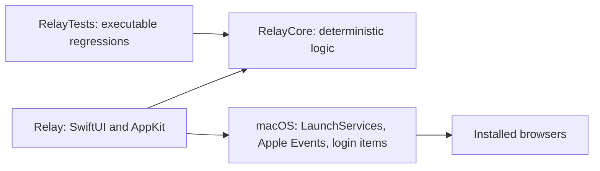

# Architecture

Relay is a native macOS menu bar app built with SwiftUI and AppKit. It has no third-party runtime dependencies. Swift Package Manager defines three targets:

| Area | Responsibility |
| --- | --- |
| `Sources/RelayCore` | URL validation/extraction, tracking cleanup, warnings, rule resolution, settings persistence, temporary defaults, serial queue |
| `Sources/Relay` | App lifecycle, menu bar, browser discovery/launch, keyboard shortcut, tab transfer, user-facing recovery |
| `Sources/Relay/Picker` | Picker view, keyboard selection, queue presentation and dismissal |
| `Sources/Relay/Settings` | General settings, rule editing/testing, browser visibility, setup help |
| `Tests/RelayTests` | A dependency-free executable harness with nonzero exit on failure |
| `Scripts` | Local build/install, Apple Silicon release packaging, public-content checks |

UI state is main-actor isolated. Incoming links share a serial queue whose active request is identified by UUID. Browser launch completion or recovery releases that request; stale callbacks cannot release another request. Routing is resolved when a request reaches the front, so a rule just saved can apply to the next link.

Settings use a versioned JSON format and atomic writes. Unsupported future schemas remain read-only; corrupt settings are preserved for recovery. OS-level registration and permissions are managed by macOS, outside the settings file.
