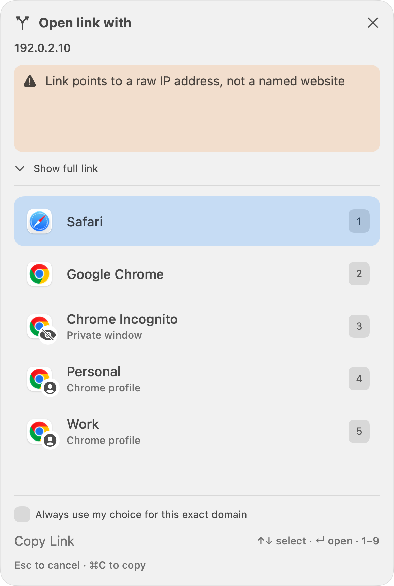
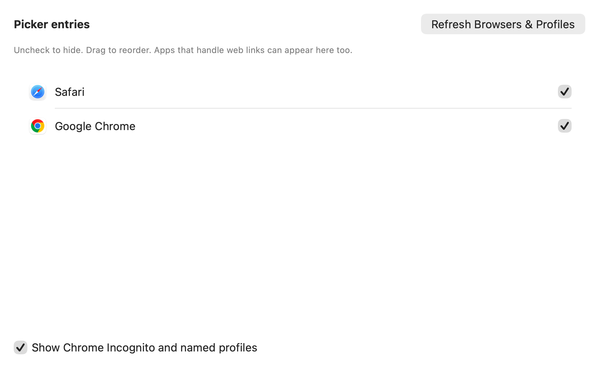

# Relay interface gallery

Explore the browser picker and settings before installing. These lossless PNG images are rendered from Relay 1.3.0’s actual SwiftUI/AppKit views at **3× resolution**, using isolated sample settings. They show illustrative configurations; they are not captures of someone’s browsing data. Select any image to view its full resolution.

[Download Relay](https://github.com/sumanth-botlagunta/relay/releases/latest) · [Installation guide](INSTALL.md) · [Back to README](../README.md)

## Choose a browser or profile

Open a link in Safari, Chrome, Incognito, or a named Chrome profile. Click an entry, press its number, or use the arrow keys and Return. “Personal” and “Work” are example profile names.

## Inspect the destination

Expand link details to see the cleaned destination and the original address. Keep the original URL when you need its parameters.

## Work through queued links

The waiting count makes multiple links visible. Skip moves past one link; Escape dismisses the whole group.

## Notice suspicious-link warnings

Local heuristics can flag a raw IP address before opening it. This example uses a documentation-only address and does not represent an active site. Warnings are not a guarantee that other links are safe.

## Route familiar sites automatically

Send a site to a browser, Chrome profile, or Incognito window. Rules run in order; the first match wins. The Test a link area previews behavior without opening a browser.

## Choose which browsers appear

Hide entries, reorder the picker, refresh discovery, and choose whether Chrome profiles and Incognito appear.

## Adjust General settings

Choose a primary browser, configure login launch, enable tracking cleanup and local warnings, and change the picker or Send Tab shortcuts.

Browser names and icons belong to their respective owners. No vendor endorsement is implied.
